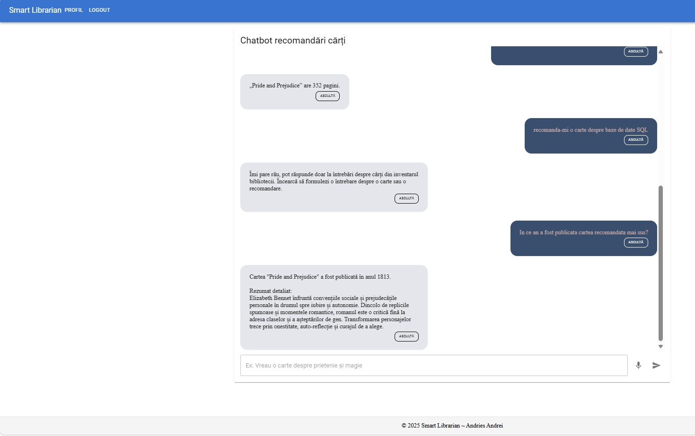

# 📚 Smart Librarian – AI Book Recommendation Platform  

Smart Librarian is a full-stack application that uses artificial intelligence to recommend books, providing detailed summaries, themes, and managing user preferences. The platform combines a fast backend (FastAPI + Chroma + OpenAI) with React + Vite + Material UI.  

---

## Main Features  

- **Personalized AI Recommendations:** Chatbot that suggests relevant books based on preferences and conversation history.  
- **RAG + LLM:** Pipeline that filters language, uses retrieval augmented generation and tool calling for detailed summaries.  
- **Summary & themes:** For each book, you get a summary and the main themes (e.g., identity, love, adventure).  
- **Authentication & account management:** Registration, login, password reset with OTP via email, logout, authentication status.  
- **User preferences:** Set and save preferred genres for more relevant recommendations.  
- **Anonymous limitation:** Unauthenticated users receive a single free recommendation.  
- **Observability:** Detailed logs for events and API costs.  
- **Admin tools:** Endpoints for quick data cleanup (users, preferences, db) with role or secret.  
- **Modern frontend:** Responsive UI, interactive chat, instant feedback, TTS (text-to-speech) for answers.  

---

## Quick Setup  

### 1. Clone project  
```sh
git clone --depth 1 --filter=blob:none --sparse https://github.com/dorinandries/davax.git  
git sparse-checkout set August/Essentials_LLM/NouSmartLibrarian  
cd August/Essentials_LLM/NouSmartLibrarian  
```

### 2. Backend  
```sh
cd backend  
python -m venv .venv  
.venv/bin/activate  # or .venv\Scripts\activate on Windows  
pip install -r requirements.txt  
```

#### 3. Configure .env  
Create a `.env` file in the `backend/` directory with the following content (replace values with your own):  
```
APP_HOST=0.0.0.0  
APP_PORT=8000  
FRONTEND_ORIGIN=http://localhost:5173  
ENV=dev  

JWT_SECRET=change_with_a_random_secret  
JWT_ALG=HS256  
ACCESS_TOKEN_EXPIRE_MINUTES=15  
REFRESH_TOKEN_EXPIRE_DAYS=7  

SQLITE_URL=sqlite:///./app.db  

REDIS_URL=redis://localhost:6379/0  
OTP_TTL_SECONDS=600  
OTP_SEND_COOLDOWN_SECONDS=60  
OTP_RATE_LIMIT_PER_HOUR=50  

ADMIN_SECRET=change_with_an_admin_secret  
ADMIN_BOOTSTRAP_ENABLED=true  
ADMIN_USERNAME=admin  
ADMIN_EMAIL=admin@email.com  
ADMIN_PASSWORD=Admin123!  
ADMIN_OVERWRITE_PASSWORD=false  

SMTP_HOST=sandbox.smtp.mailtrap.io  
SMTP_PORT=587  
SMTP_USER=xxxxxxx  
SMTP_PASS=xxxxxxx  
SMTP_FROM="Smart Librarian <hello@demomailtrap.co>"  

OPENAI_API_KEY=sk-...  
CHAT_MODEL=gpt-4.1-nano  
EMBEDDING_MODEL=text-embedding-3-small  

PRICE_CHAT_INPUT=0.0001  
PRICE_CHAT_OUTPUT=0.0004  
PRICE_EMBEDDING=0.00002  
```

**Note:**  
- For email, you can use [Mailtrap](https://mailtrap.io/) or any real SMTP.  
- For OpenAI, enter your personal key.  

#### 4. Start Redis  
```sh
docker run -p 6379:6379 redis:7-alpine  
```

#### 5. Populate database with summaries  
At the first call to `/chat/recommend`, the Chroma collection is created. For bulk population, run in the project console:  
```sh
python app/seed_chroma.py  
```

#### 6. Run backend  
```sh
uvicorn app.main:app --reload  
```

---

### 7. Frontend  
```sh
cd ../frontend  
npm install  
npm run dev  
```

---

## Databases Used  

### 1. SQLite  
- **Role:** User data persistence, authentication, preferences, logs, and administration.  
- **Why SQLite?** It’s fast, easy to integrate with FastAPI, requires no separate server, and is ideal for prototyping or apps with medium data volume.  
- **Usage:** All CRUD operations for users, preferences, logs, and admin are done via SQLite (`backend/app.db`).  

### 2. ChromaDB  
- **Role:** Vector store for AI embeddings, used in semantic search and book recommendations.  
- **Why Chroma?** Optimized for storing and querying embeddings, has native OpenAI integration, and allows fast retrieval for the RAG pipeline.  
- **Usage:** Stores embeddings for summaries and book metadata, used for recommendations and contextual searches (`backend/chroma/chroma.sqlite3`).  

### 3. Redis  
- **Role:** Cache and temporary storage for OTP, rate-limiting, and sessions.  
- **Why Redis?** Extremely fast, ideal for temporary operations, rate-limit, and OTP management.  
- **Usage:** Used for OTP generation/validation, access limiting, and cooldown on password reset.  

---

## Project Structure  
- `backend/` – API, logs, seed, Chroma, SQLite, Redis, data, configuration  
- `frontend/` – React, pages, context, styles, API client  

---

## Security & Observability  
- JWT tokens with automatic refresh.  
- Rate-limit and cooldown for OTP.  
- Detailed logs in `logs/`.  
- Admin endpoints protected with role or secret.  

---

## Future Extensions  
- Recommendations based on preferred genres from user profile.  
- Conversation history.  
- Export preferences and recommendations.  
- Integration with other AI models.  

---

## Application Functionality Demonstration  

### 1. Recommendations without account (free trial)  
The images below show how an unauthenticated user can receive up to 3 book recommendations:  
  
  
  

### 2. Chat as authenticated user  
After login, the user has access to unlimited recommendations and additional features:  
  
  

### 3. Account creation with email verification  
The registration process involves entering the email, receiving a verification code, and confirming the address:  
  
  
  

### 4. Password reset with email verification  
When resetting the password, the email is entered, a validation code is received, then the new password is set:  
  
  
  
