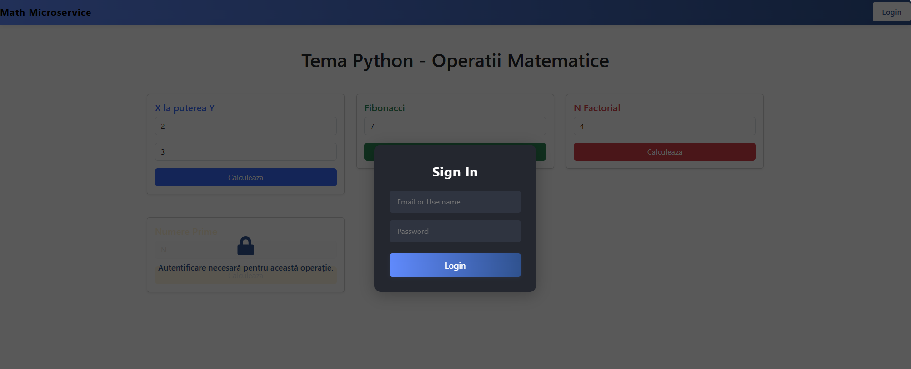

# Math Microservice Project

## Overview

This project is a **production-ready microservice** for mathematical operations, featuring:

- **REST API** (no SOAP) for:
  - Power function (`x^y`)
  - N-th Fibonacci number
  - Factorial
  - Prime number check (requires authentication)
- **Frontend**: Modern React web interface
- **Backend**: FastAPI microservice
- **Database**: SQLite for request persistence
- **Authentication**: JWT-based login system
- **Caching**: In-memory caching for fast repeated calculations
- **Logging**: 
  - File-based logging (daily folders in `/logs`)
  - Kafka-based logging for API requests (bonus)
- **Monitoring**: Prometheus metrics endpoint
- **Containerization**: Docker & Docker Compose for easy deployment

---

## Architecture

- **Frontend** ([frontend/](frontend/)): React app for user interaction, authentication, and calling math APIs.
- **Backend** ([backend/](backend/)): FastAPI app exposing REST endpoints, handling auth, caching, DB, and Kafka logging.
- **Database**: SQLite file (`math_results.db`) for storing all API requests and user data.
- **Kafka**: Used for streaming API request logs.
- **Prometheus**: Metrics exposed at `/api/v1/metrics` for monitoring.

---

## Features

- **API Endpoints**:
  - `POST /api/v1/putere`: Calculate `x^y`
  - `POST /api/v1/fibo`: N-th Fibonacci number
  - `POST /api/v1/factorial`: Factorial
  - `POST /api/v1/prime`: Prime check (JWT required)
  - `POST /api/v1/login`: User login (JWT)
  - `POST /api/v1/register`: User registration
  - `POST /api/v1/user`: Get user info by ID
  - `DELETE /api/v1/user`: Delete user by ID from DB
  - `GET /api/v1/health`: Health check
  - `GET /api/v1/metrics`: Prometheus metrics

- **Persistence**: All requests and results are stored in the database.
- **Caching**: Results are cached in-memory for fast repeated queries.
- **Logging**:
  - All requests are logged to daily log files in `backend/logs/YYYY-MM-DD/`.
  - Kafka logs all API requests to the `api_requests` topic.
- **Authentication**: JWT-based, required for prime number check.
- **Monitoring**: Prometheus metrics endpoint for monitoring.

---

## Getting started

### 1. Clone the repository

```sh
git clone <your-repo-url>
cd <project-root>
```

### 2. Configure environment variables

#### Backend (`backend/.env`)

Create `backend/.env` with:

```
JWT_SECRET=your_jwt_secret_key
JWT_ALGORITHM=HS256
```

#### Frontend (`frontend/.env`)

Create `frontend/.env` with:

```
REACT_APP_API_URL=your_host_url 
```
Eg: REACT_APP_API_URL="http://localhost:8000/api/v1"

### 3. Build and run with docker compose

Ensure Docker and Docker Compose are installed.

```sh
docker-compose build --no-cache
docker-compose up -d
```
Check if the instances are running. Should show backend, frontend, and kafka instances.
```sh
docker-compose ps
```
### 4. Using the application

- Open [http://localhost:3000](http://localhost:3000) in your browser.
- Register a new user or log in.
- Use the UI to perform math operations.
- Prime number check requires authentication.

---

## Logs

- All backend logs are stored in `backend/logs/YYYY-MM-DD/`:
  - `requests.log`: All API requests
  - `kafka_logs.log`: Kafka logging activity

---

## Monitoring

- Prometheus metrics available at: [http://localhost:8000/api/v1/metrics](http://localhost:8000/api/v1/metrics)

---

## Extensibility

- The backend is modular (MVC/MVCS), making it easy to add new math operations or endpoints.
- Caching, logging, and DB layers are abstracted for easy extension.

---

## Development notes

- **Database**: SQLite file is persisted and mounted via Docker volume.
- **Kafka**: Uses Bitnami images for Kafka and Zookeeper.
- **Frontend**: Uses React, Bootstrap, and JWT for authentication.

---

## Folder structure

- [frontend/](frontend/): React app
- [backend/](backend/): FastAPI app, DB, logs, Kafka, etc.

---

## Troubleshooting

- If you change `.env` files, restart Docker Compose.
- Logs are rotated daily and stored in subfolders under `backend/logs/`.
- For Kafka logs, ensure Kafka and Zookeeper containers are running.

---

## Demo

Below are screenshots of the application interface:



