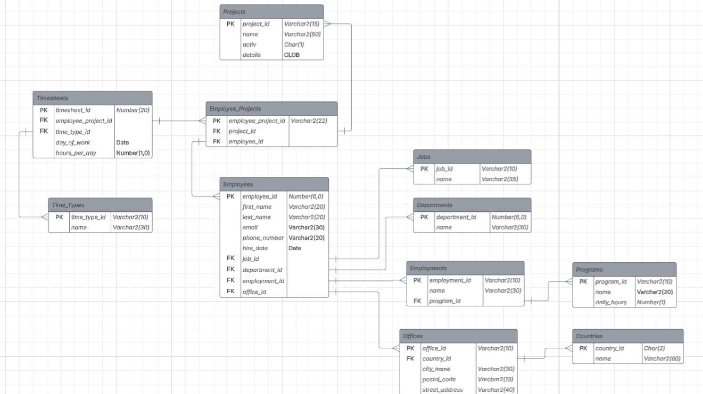

# 🗃️ RDBMS Homework – Andries Dorin Andrei

This repository contains the solution for the RDBMS homework assignment.

## 📌 Setup Instructions

### 1. Create Tablespaces and User

Connect to your Oracle Database as the **SYS** user and execute:

```sql
@timesheet_tema1_config.sql
```
This will:

- Create the necessary tablespaces.

- Create the tema1_user account.

2. Run Homework Solution Script
Connect to the database using the following credentials:
```
Username: tema1_user

Password: tu
```
Then execute:

```sql
@timesheet_tema1_user.sql
```

This script includes all statements that form the complete solution.

🧾 Notes
Ensure all SQL files are located in the same directory for smooth execution.

A database diagram image is included for reference in understanding the schema.

## 🖼️ Database Schema


